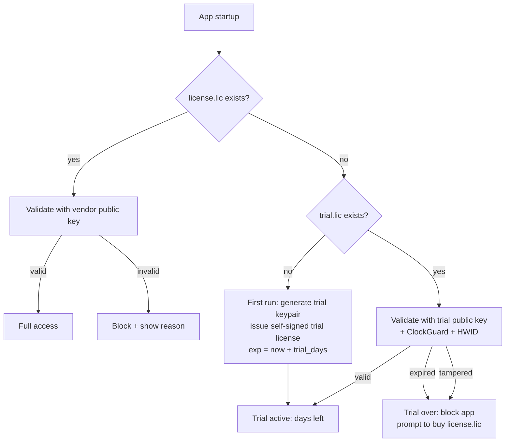

<p align="center">
  
</p>

<h1 align="center">py-Rizmi Licensing</h1>

<p align="center">
  <a href="https://github.com/Ramzi-Hadrouk/py-rizmi/actions/workflows/ci.yml">
    
  </a>
  <a href="https://pypi.org/project/py-rizmi/">
    
  </a>
  =3.12">
  <a href="https://github.com/Ramzi-Hadrouk/py-rizmi/blob/main/LICENSE">
    
  </a>
</p>

<p align="center">
py-Rizmi is an offline-first licensing toolkit that helps developers protect and distribute Python software through cryptographically signed licenses,
hardware-bound activation, and secure local validation, while remaining flexible for future online licensing workflows.
</p>

---

## Table of Contents

1. [Overview](#overview)
2. [Features](#features)
3. [Architecture](#architecture)
4. [Quick Start](#quick-start)
5. [GUI Usage Guide](#gui-usage-guide)
6. [CLI Reference](#cli-reference)
7. [Integration Workflow](#integration-workflow--from-start-to-finish)
8. [Developer Integration Guide](docs/integration-guide.md)
9. [Testing](#testing)
9. [Building an Executable](#building-an-executable)
10. [Project Structure](#project-structure)
11. [Contributing](#contributing)
12. [License](#license)

---

## Overview

**py-Rizmi Licensing** enables you to issue, validate, and inspect
offline RSA-signed license files using JWT tokens. It is built for deployment
environments where internet access is unavailable — the license is validated
locally using a public key and a hardware fingerprint (HWID).

The entire core layer is pure Python with zero GUI dependencies, making it
suitable for integration into any Python application or web backend.

---

## Features

- **RSA Keypair Management** — Generate (2048/3072/4096-bit), load, paste,
  and validate RSA keypairs. Verify that private and public keys match.
- **Machine Fingerprinting** — Deterministic SHA-256 hardware ID based on
  the OS-level machine identifier. Pluggable via `FingerprintProvider` Protocol.
- **License Issuance** — Sign arbitrary payload fields into a JWT token
  and save as a `.lic` file with `schema_version` for future-proofing.
- **License Validation** — Verify signature, expiration (with grace period
  enforcement), and HWID match on any machine.
- **License Swap Authorization** — Cryptographically sign and verify short-lived
  license swap authorization requests (`.rzswap`) without exposing private key material
  to application servers.
- **Clock Tamper Protection** — Persist a local high-water mark and
  session drift check to catch obvious clock rollback attempts in offline
  validation flows.
- **License Viewer** — Decode and inspect any `.lic` file with the
  matching public key — no private key needed.
- **Integration Guide** — In-app rendered README with Python API docs
  and backend integration examples.
- **Public API** — Curated `__all__` surface (`RizmiConfig`,
  `LicenseValidator`, `LicenseIssuer`, `KeyPair`, `MachineFingerprint`,
  `LicensePayload`, `LicenseSwapPayload`, `ReplacementAuthorizationPayload`,
  `RevocationList`, `create_revocation_list`, `sign_revocation_list`,
  `verify_revocation_list`, `TrialManager`, `TrialStatus`,
  `LicenseWatchdog`, `LicenseWatchdogError`, `create_swap_request`,
  `create_replacement_authorization_payload`, `sign_swap_request`,
  `sign_authorization_payload`, `verify_swap_authorization`,
  `verify_authorization`) covered by SemVer.
- **PyQt6 GUI** — Sidebar-navigated desktop application for cross-platform use.
- **CLI** — Headless issuance, key generation, validation, license swap signing,
  and HWID retrieval via `rizmi` commands (Typer + Rich).
- **Backend Module** — Drop-in validation function for app-server integration.
- **Fully Tested** — 110+ pytest tests with Hypothesis property tests, contract
  tests, regression tests, e2e tests, GUI tests, and ruff + mypy enforcement.

---

## Architecture

```
py_rizmi/core/          ← Pure Python. No GUI. 100% testable.
py_rizmi/core/swap_auth.py   ← Core license swap request creation, signing & verification.
py_rizmi/core/clock_guard.py ← Local clock rollback protection and persistence.
py_rizmi/models/        ← LicensePayload & LicenseSwapPayload dataclasses.
py_rizmi/integrations/  ← Server-side validation helper + clock guard wiring.
py_rizmi/gui/           ← PyQt6 widgets. Depends on core/. Optional [gui] extra.
py_rizmi/cli/           ← Typer CLI (rizmi command). Depends on core/.
py_rizmi/_internal/     ← Private implementation — never import directly.
tests/                  ← pytest suite. Imports only core/.
```


Fingerprint sources implement the `FingerprintProvider` Protocol, making
the fingerprinting layer extensible without modifying core code.

Every payload field is a bound input widget — there is zero hard-coded
payload data anywhere in the codebase.

---

## Quick Start

```bash
# Recommended — with uv (uses the lockfile for reproducible installs)
uv sync --extra dev          # development (core + test tools)
uv sync --extra gui          # with GUI support
uv sync --extra all          # everything

# With pip (manually resolve dependencies)
pip install py-rizmi          # core only
pip install py-rizmi[gui]     # with GUI
pip install -e ".[dev]"       # local development
```

You have **two ways** to use the toolkit:

### 🖥️  GUI Mode

Launch the full desktop application with sidebar navigation:

```bash
# Recommended (installed package)
rizmi gui

# Alternative (run directly from repo)
python main.py
```

> **Requires the `[gui]` extra.** If not installed, `rizmi gui` will print a
> friendly install hint instead of crashing. Install with:
> ```bash
> pip install py-rizmi[gui]
> # or with uv:
> uv sync --extra gui
> ```

All features — key generation, license issuance, viewer, and the
integration guide — are accessible through the interface.

### ⌨️  CLI Mode

The `rizmi` command (Typer + Rich) provides headless access to all features:

```bash
# Generate an RSA keypair
rizmi keys generate \
  --private-out keys/private_key.pem \
  --public-out keys/public_key.pem \
  --key-size 2048 \
  --passphrase

# Get this machine's hardware fingerprint
rizmi machine-id

# Issue a signed license file
rizmi license issue \
  --private-key keys/private_key.pem \
  --output license.lic \
  --client "Acme Corp" \
  --license-id "deploy-001" \
  --hwid "<paste-the-hwid-here>" \
  --features billing --features reports \
  --max-clients 10 \
  --grace-days 14 \
  --exp-days 365

# Validate and inspect a license
rizmi license validate license.lic --public-key keys/public_key.pem
rizmi license inspect license.lic --public-key keys/public_key.pem

# Sign a license swap request file
rizmi license sign-swap \
  --request swap_request.json \
  --private-key keys/private_key.pem \
  --output authorization.rzswap

# Verify a signed license swap authorization file
rizmi license verify-swap authorization.rzswap \
  --public-key keys/public_key.pem \
  --current-license current.lic \
  --new-license replacement.lic
```

---

## GUI Usage Guide

The application opens a window with a **sidebar** on the left and a content
area on the right. Click any navigation item to switch views.

### Machine ID

Navigate to **Machine ID** in the sidebar, then:

1. Click **Generate Machine ID**.
2. The raw fingerprint and SHA-256 hash are displayed.
3. Click **Copy HWID** and send this hash to your license issuer.

### Key Management

Navigate to **Key Management** in the sidebar. Generate, load, and validate RSA keypairs.

1. **① Generate Keypair** — Select key size (2048, 3072, or 4096) and click
   **Generate**. The private and public PEM are displayed in read-only text
   areas. Use **Save** and **Copy** to export or copy each key.
2. **② Load Keys** — Browse for existing `.pem` files on disk, or **Paste**
   PEM content from the clipboard.
3. **③ Validate Pair** — Click **Validate Keypair** to confirm both PEMs
   belong together. Result shows key size or a mismatch error.

### License Generation

Navigate to **License Generation** in the sidebar.

1. **① Signing Key** — Browse for an existing private key `.pem` file.
2. **② License Payload** — Fill in every field:
   - Client / Deployment (required)
   - License ID (required)
   - HWID (required — click **← Tab 1** to pull from Machine ID view)
   - Features (add/remove dynamically)
   - Max Clients, Mode, Server URL, Grace Days
   - Issued At (iat) and Expiration (exp) — auto or manual.
3. Click **Preview Payload (JSON)** to inspect the data before signing.
4. Click **Generate License** and save the `.lic` file.

### License Viewer

Navigate to **License Viewer** in the sidebar.

1. Select the matching **public key** `.pem` file.
2. Select the **license file** `.lic` to inspect.
3. Click **Decode & View** — all fields are displayed read-only, along
   with expiry status and days remaining.

### License Swap

Navigate to **License Swap** in the sidebar.

1. Select the **Swap Request File** (`.json`) generated by the application server.
2. Select your RSA **Private Key** `.pem` file (and enter passphrase if encrypted).
3. Click **Sign License Swap Authorization** — inspect the generated output.
4. Click **Save Authorization File...** to save the signed `.rzswap` payload file.

### Revocation

Navigate to **Revocation** in the sidebar.

1. Enter one or more **License IDs** to revoke (leave empty to publish a
   clean list that un-revokes everything).
2. Select your RSA **Private Key** `.pem` file (and passphrase if encrypted).
3. Set **Next Update (hours)** — the advisory refresh horizon embedded in
   the list (offline validators keep accepting the last known list after
   it passes).
4. Click **Sign Revocation List**, then **Save Revocation List...**.

Distribute the resulting JSON to your apps and load it with
`LicenseValidator(public_key, revocation_list=...)` — any license whose
ID is on the list fails validation with `revoked`.

### SQLite State Store & In-App License Activation (v2)

Instead of scattering `license.lic` / `trial_key.pem` / clock-state
files across the user's disk, py-rizmi can keep **all state in one
tamper-evident SQLite database** (per-app, in the OS user-data dir):

- every row is HMAC-verified against a machine+app-bound key before use —
  editing the SQL data is always **detected** and rejected (`tampered`);
- the vendor public key stays **compiled into your binary** — never in
  writable storage — protected by a SHA-256 fingerprint self-check;
- each app passes its own `app_name`, so multiple py-rizmi apps on one
  machine cannot read or overwrite each other's state.

```bash
rizmi keys fingerprint --public keys/public_key.pem   # paste into your source
```

```python
from py_rizmi import (
    RizmiConfig, LicenseActivator, LicenseWatchdog, StateStore,
    TrialManager, key_fingerprint, pin_fingerprint,
)

VENDOR_PUBLIC_KEY = """-----BEGIN PUBLIC KEY-----
...your embedded public key...
-----END PUBLIC KEY-----"""
VENDOR_KEY_FINGERPRINT = "sha256-hex-from-rizmi-keys-fingerprint"

# Startup gate: refuse to run if either constant was patched.
pin_fingerprint(VENDOR_PUBLIC_KEY, VENDOR_KEY_FINGERPRINT)

config = RizmiConfig(use_sqlite=True, app_name="MyProduct")
store = StateStore(config.db_path or StateStore.default_path("MyProduct"),
                   machine_id=MachineFingerprint.get_machine_id(),
                   app_name="MyProduct")
activator = LicenseActivator(store, VENDOR_PUBLIC_KEY)

# ── In-app license entry (developer-hosted UI) ──────────────────────
# Method A — user pastes the license token into your text field:
result = activator.activate_token(pasted_text.strip())
# Method B — user picks their license.lic file:
result = activator.activate_file(chosen_path)

if result.ok:
    print(f"Licensed to {result.payload.client}")   # accepted
else:
    show_error(result.reason)   # 'tampered', 'hwid_mismatch', 'expired', ...
```

Activation runs the **full validation chain** (signature → expiry → HWID →
revocation → clock guard) *before* anything is stored; only valid licenses
are accepted. `activator.current()` re-validates on every read.

Trials work in SQLite mode too:

```python
trial = TrialManager(
    config_dir="path/to/app-config", trial_days=14,
    public_key=VENDOR_PUBLIC_KEY,
    use_sqlite=True, db_path=store.db_path, app_name="MyProduct",
)
status = trial.start_or_check()
```

> **Packaged apps (Nuitka / PyInstaller):** works unchanged. Paths never
> derive from `__file__`; prefer Nuitka (`--include-package=py_rizmi`) —
> compiled constants resist public-key patching far better than archive-
> based packagers.
>
> **Honest threat model:** local storage is tamper-*evident*, not
> tamper-proof. A determined reverse engineer with a debugger wins; this
> raises the bar against casual-to-moderate piracy, which is where the
> real volume is.

### Trial Period — License-Free Evaluation

Let clients use your app for N days without any license file. On first
run the app issues itself a **self-signed trial license** (bound to the
machine, protected by the same ClockGuard anti-rollback used for real
licenses). When the trial ends the app blocks until the client buys a
real `license.lic` — which always supersedes the trial, even mid-trial.



#### Integration (3 lines at startup)

```python
from py_rizmi import TrialManager

trial = TrialManager(
    config_dir="path/to/app-config",   # your app's config dir
    trial_days=14,                     # your trial length
    public_key=vendor_public_key_pem,  # already embedded for validation
)
status = trial.start_or_check()
if not status.ok:
    ...  # trial expired / tampered / license invalid: block or degrade
```

`status.state` is one of `licensed`, `trial_active` (with `days_left`),
`trial_expired`, `tampered`, `licensed_invalid` (a real license exists
but fails validation — never silently falls back to trial), or
`no_trial`. Pair with `LicenseWatchdog` to enforce trial expiry in
long-running backends without a restart.

#### What the trial protects against

| Attack | Defense |
|---|---|
| Editing `trial.lic` to extend it | Trial-file signature check → `tampered` |
| Copying another machine's trial | HWID binding → `tampered` |
| Rolling the clock back | ClockGuard high-water mark → `tampered` |
| Deleting `trial.lic` to restart | Start date ratcheted into redundant ClockGuard state — a new trial inherits the original date |

Like all offline mechanisms, this raises the bar against
casual-to-moderate tampering, not a determined reverse engineer.

#### CLI diagnostics

```bash
rizmi trial status --config-dir ./app-config --public-key vendor_pub.pem [--json]
rizmi trial reset --config-dir ./app-config --confirm   # developer diagnostics only
```

### Integration Guide


In-app rendered view of this README — Python API docs, CLI usage, and
backend integration instructions.

---

## CLI Reference

The `rizmi` CLI is the recommended interface for all headless operations.
Every command supports `--help` / `-h`:

```bash
rizmi --help
rizmi keys --help
rizmi license --help
rizmi machine-id --help
rizmi gui --help
```

### Key Management — `rizmi keys`

| Command | Description |
|---|---|
| `rizmi keys generate` | Generate a new RSA keypair (2048 / 3072 / 4096 bits) |
| `rizmi keys inspect <key.pem>` | Show key type, size, and fingerprint |
| `rizmi keys verify --private ... --public ...` | Verify a private/public key pair matches |

### License Operations — `rizmi license`

| Command | Description |
|---|---|
| `rizmi license issue` | Sign and write a `.lic` token file (`--from-json <req.json>` for a JSON spec) |
| `rizmi license validate <file.lic>` | Validate signature, expiry, and HWID |
| `rizmi license inspect <file.lic>` | Decode and display all payload fields |
| `rizmi license revoke` | Build and sign a revocation list from license IDs |
| `rizmi license create-swap-request` | Generate a license swap request JSON locally |
| `rizmi license sign-swap` | Sign a license swap request file locally using RSA private key |
| `rizmi license verify-swap <auth.rzswap>` | Verify a signed license swap authorization file against public key and licenses |


### Machine Fingerprint — `rizmi machine-id`

```bash
rizmi machine-id           # rich panel output
rizmi machine-id --raw     # plain hash only (for piping)
rizmi machine-id --copy    # copy to clipboard
```

### Trial Period — `rizmi trial`

| Command | Description |
|---|---|
| `rizmi trial status --config-dir DIR --public-key KEY [--json]` | Show trial/license status (`licensed`, `trial_active`, `trial_expired`, `tampered`, ...) |
| `rizmi trial reset --config-dir DIR --confirm` | Reset trial state (developer diagnostics only) |

### GUI — `rizmi gui`

```bash
rizmi gui                  # launch the PyQt6 desktop application
```

Requires the `[gui]` extra (`pip install py-rizmi[gui]`). Without it,
the command exits with code `1` and prints a clear install hint.

### Full Example Workflow

```bash
# 1. Generate keys
rizmi keys generate --private-out keys/private.pem --public-out keys/public.pem

# 2. Get HWID of the target machine
rizmi machine-id --raw

# 3. Issue a license
rizmi license issue \
  --private-key keys/private.pem \
  --output license.lic \
  --client "Acme Corp" \
  --license-id "deploy-001" \
  --hwid "<hwid-from-step-2>" \
  --features billing --features reports \
  --exp-days 365

# 4. Validate on the target machine
rizmi license validate license.lic --public-key keys/public.pem

# 5. Inspect a token (author side, no HWID check)
rizmi license inspect license.lic --public-key keys/public.pem
```

> To protect the private key at rest, add `--passphrase` to `keys generate`.
> When issuing with an encrypted key, pass `--key-passphrase` or set
> the `RIZMI_KEY_PASSPHRASE` environment variable.

---

## Integration Workflow — From Start to Finish

> **Deep dive:** For the complete, no-gaps developer reference — every API,
> CLI flag, error code, revocation, trial, watchdog, and swap flow — see
> [`docs/integration-guide.md`](docs/integration-guide.md).

The recommended path is to use **`rizmi gui`** (or `python main.py`) for interactive
tasks and fall back to **CLI commands** (`rizmi ...`) when you need
to automate or work on a headless server.

### Step 1 — Generate an RSA Keypair

**GUI (recommended):** Open the app → **Key Management** view → pick a key
size → click **Generate** → **Save** both `.pem` files.

**CLI (headless/automation):**
```bash
rizmi keys generate \
  --private-out keys/private_key.pem \
  --public-out keys/public_key.pem \
  --key-size 2048
```

> 🔒 `private_key.pem` stays on your authoring machine — never ship it.

### Step 2 — Get the Machine HWID

**Run this on the target machine** where the licensed app will be deployed.

**GUI (recommended):** Open the app (`rizmi gui`) → **Machine ID** view → click
**Generate Machine ID** → **Copy HWID**.

**CLI (headless server):**
```bash
rizmi machine-id
# HWID (SHA-256): fb50b7767d233a9ecc952dd9c11760586b3bd1a40d6bfbec051a312f0b51c77c
```

Send this hash to your license author.

### Step 3 — Issue a License

**GUI (recommended):** Open the app → **License Generation** view →
select the private key, fill in the payload fields (including the HWID
from Step 2), add features, set dates → **Generate License**.

**CLI (headless/automation):**
```bash
rizmi license issue \
  --private-key keys/private_key.pem \
  --output license.lic \
  --client "Acme Corp" \
  --license-id "deploy-001" \
  --hwid "<paste-hwid-here>" \
  --features billing --features reports \
  --max-clients 10 \
  --exp-days 365
```

Deliver `public_key.pem` and `license.lic` to the developer integrating
the app.

### Step 4 — Integrate Validation Into Your App

The developer embeds `public_key.pem` and `license.lic` and validates
at startup — no GUI or script needed here, just the Python API:

```python
from py_rizmi import LicenseValidator

validator = LicenseValidator.from_file("path/to/public_key.pem")

try:
    payload = validator.validate_from_file("path/to/license.lic")
    print(f"Licensed to {payload.client}")
    if payload.in_grace_period:
        print("Warning: license is in grace period")
except ValueError as e:
    print(f"License invalid: {e}")
```

> **Grace-period semantics:** validation only raises `expired` once the
> license's `exp` **plus** its `grace_days` window has passed. Inside that
> window, validation *succeeds* and the returned payload has
> `in_grace_period = True` (also available as `payload.is_in_grace()`).
> If your app must hard-stop at `exp` with no grace, check the flag and
> treat it as expired.

#### Runtime Enforcement for Long-Running Apps

A startup check alone lets an expired license keep running inside a
process that stays up for weeks (backend servers, workers). Use
`LicenseWatchdog` to re-validate periodically and stop immediately when
the license turns invalid — no restart required:

```python
from py_rizmi import LicenseValidator, LicenseWatchdog

validator = LicenseValidator.from_file("path/to/public_key.pem")

watchdog = LicenseWatchdog(
    validator,
    "path/to/license.lic",
    interval_seconds=600,          # re-check every 10 minutes
    on_violation=lambda reason, detail: server.shutdown(),
    strict_start=True,             # refuse to start on an invalid license
)
watchdog.start()
```

- `on_violation(reason, detail)` fires once when the license stops being
  honored (`expired`, `tampered`, `hwid_mismatch`, `clock_tampering`,
  `missing`, ...). Do your shutdown there — the watchdog never kills the
  process itself.
- `on_grace(payload)` fires when the license is expired but still inside
  its grace window; degrade gracefully or warn at that point.
- Callbacks fire on state *changes* only, so shutdown handlers are not
  re-invoked every poll. Call `watchdog.stop()` on app shutdown (or use
  it as a context manager).

### Step 5 — Server-Side Drop-In (Optional)

For apps with a validation server:

```python
from py_rizmi.integrations.validation import validate_license

try:
    payload = validate_license("/path/to/config/dir", app_name="YourProduct")
    # config dir must contain public_key.pem and license.lic
    print(payload["client"], payload["features"])
except ValueError as e:
    print(f"License invalid: {e}")
```

The drop-in validator enables local clock rollback protection by default
and may raise `clock_tampering` alongside the standard validation errors.
Pass `enable_clock_guard=False` only for diagnostics or tests.
The direct `LicenseValidator` API also accepts an optional `clock_guard`
argument for the same behavior.

The same grace-period rule applies here: an in-grace license does not
raise — check `payload["in_grace_period"]` in the returned dict to detect it.

### License Swap Authorization

Applications requiring authorized license replacement (e.g. Django web backend integration) use `verify_swap_authorization` to cryptographically verify replacement payloads without handling private keys:

```python
from py_rizmi import (
    create_swap_request,
    sign_swap_request,
    verify_swap_authorization,
)

# 1. App/Server creates a short-lived swap request payload
payload = create_swap_request(
    current_license="<current-license-token>",
    new_license="<new-license-token>",
    valid_minutes=60,
)

# 2. License owner signs locally with private key (CLI / GUI)
authorization_envelope = sign_swap_request(payload, private_key_pem)

# 3. Application server verifies license swap authorization
is_valid, reason, verified_payload = verify_swap_authorization(
    authorization_data=authorization_envelope,  # accepts dict or JSON string
    public_key_pem=public_key_pem,
    expected_current_license="<current-license-token>",
    expected_new_license="<new-license-token>",
)

if is_valid and verified_payload is not None:
    print("Swap authorization verified successfully:", verified_payload.request_id)
else:
    print("Verification failed:", reason)
```


---

## Testing

```bash
# Fast unit tests (no GUI dependencies)
uv run pytest -p no:qt tests/unit -v

# Full test suite (requires PyQt6 + system libEGL)
uv run pytest -v

# Linting & type checking
uv run ruff check .
uv run mypy src

# With pip (no lockfile)
pip install -e ".[dev,gui]"
pytest -v
```

All core tests cover the public API without any GUI dependencies.

---

## Building an Executable

This project uses [Nuitka](https://nuitka.net) to compile the Python code
into a standalone native executable for Linux or Windows.

### Prerequisites

```bash
# Nuitka is a dev dependency
uv sync --extra dev

# Linux: gcc / g++ must be installed
sudo apt install gcc g++ python3-dev  # Debian / Ubuntu

# Windows: Download and install MSVC from Visual Studio Build Tools
```

### Build

```bash
# Standalone folder (recommended — faster build, easier debugging)
bash build.sh standalone

# Single executable (longer build, larger file)
bash build.sh onefile
```

Output goes to `dist/py-rizmi/`.

> **Cross-platform note:** Build on each target OS separately.
> Linux builds produce Linux binaries, Windows builds produce `.exe`.
> Use GitHub Actions with matrix runners (ubuntu, windows) to automate this.

### What Gets Bundled

| Resource | How | Why |
|----------|-----|-----|
| `media/logo.png` | `--include-data-dir` | Window icon & in-app logo |
| `README.md` | `--include-data-file` | Integration Guide view |
| PyQt6, qdarktheme, markdown, PyJWT, cryptography | Auto-detected by Nuitka | Runtime dependencies |

---

## Project Structure

```
py-rizmi/
├── main.py                          # GUI entry point
├── pyproject.toml                   # Hatchling + hatch-vcs build config
├── build.sh                         # Nuitka build script
├── CHANGELOG.md                     # Keep-a-Changelog
├── CONTRIBUTING.md                  # Development guide
├── docs/
│   ├── api-stability.md             # SemVer policy
│   └── adr/
│       └── 0001-pyqt6-licensing.md  # Architecture Decision Record
├── .github/workflows/
│   ├── ci.yml                       # CI: lint + fast tests + full tests
│   └── release.yml                  # Release: build → TestPyPI → PyPI → GitHub Release
├── media/
│   └── logo.png                     # Application logo
├── src/
│   └── py_rizmi/
│       ├── __init__.py              # Public API (__all__)
│       ├── _version.py              # hatch-vcs generated (gitignored)
│       ├── core/                    # Pure logic — no GUI
│       │   ├── clock_guard.py       # Local anti-rollback clock guard
│       │   ├── crypto.py            # RSA primitives
│       │   ├── hwid.py              # Machine fingerprint + FingerprintProvider Protocol
│       │   ├── keypair.py           # RSA keypair management
│       │   ├── license_issuer.py    # Token signing
│       │   ├── license_validator.py # Token validation + decode + optional clock guard
│       │   └── swap_auth.py         # License swap request creation, signing & verification
│       ├── models/
│       │   ├── license_payload.py   # LicensePayload dataclass with schema_version
│       │   └── swap_payload.py      # LicenseSwapPayload dataclass
│       ├── gui/                     # PyQt6 GUI (optional [gui] extra)
│       │   ├── app.py               # Main window + sidebar
│       │   ├── theme.py             # Styling & theming
│       │   ├── views/
│       │   │   ├── hwid_view.py
│       │   │   ├── keymanager_view.py
│       │   │   ├── generate_view.py
│       │   │   ├── viewer_view.py
│       │   │   ├── swap_view.py
│       │   │   └── guide_view.py
│       │   └── widgets/
│       │       ├── step_card.py
│       │       └── dynamic_list.py
│       ├── integrations/
│       │   └── validation.py        # Server-side validation helper + clock state paths
│       ├── cli/                     # rizmi CLI (Typer + Rich)
│       │   ├── app.py               # Root app + help banner + --version
│       │   └── commands/
│       │       ├── keys.py          # keys generate / inspect / verify
│       │       ├── license_cmd.py   # license issue / validate / inspect
│       │       ├── swap_cmd.py      # license sign-swap / verify-swap
│       │       └── machine_id.py    # machine-id (--raw, --copy)

│       └── _internal/               # Private — never import directly
│           └── logging.py
├── keys/                            # Generated keys (gitignored)
│   └── .gitkeep
└── tests/                           # comprehensive pytest suite
    ├── unit/
    │   ├── core/                    # Core cryptography + clock guard unit tests
    │   ├── integrations/            # Integration helper tests
    │   └── models/                  # Data model unit tests
    ├── integration/                 # Hypothesis property tests
    ├── contract/                    # Golden fixtures and compatibility checks
    ├── regression/                  # Specific bug repro/regression tests
    ├── e2e/                         # CLI execution smoke tests
    └── gui/                         # PyQt6 widget and workflow tests
```

---

## Contributing

See [CONTRIBUTING.md](CONTRIBUTING.md) for the full development guide —
setup, project layout, code style (ruff + mypy), testing, and the
deprecation-shim pattern for public API changes.

### Reporting Issues

- Use the [GitHub issue tracker](https://github.com/Ramzi-Hadrouk/py-rizmi/issues).
- Include the full error output and steps to reproduce.
- Mention your Python version and operating system.

### Ideas for Contributions

Planned post-1.0 features include key rotation, online validation,
certificate revocation lists, and tamper-evident audit logs.

---

## License

This project is provided under the MIT License. See the `LICENSE` file for details.
